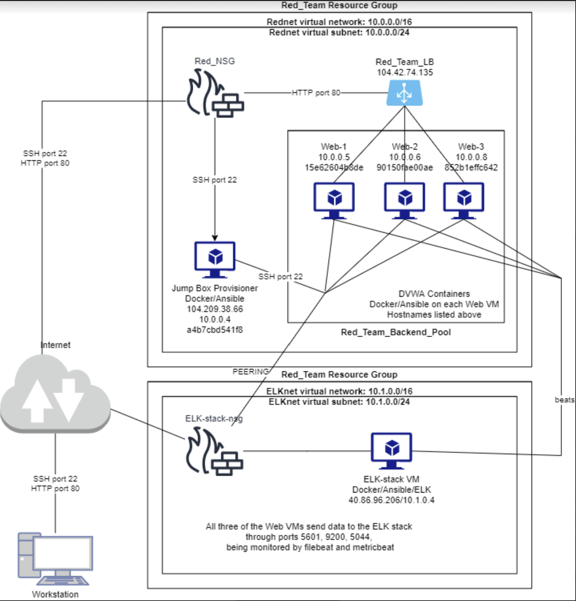

## Introduction

This repository contains all of the files used during the cloud security and elastic stack project I worked on during class.
The final setup of the network was a single jump box virtual machine used to access the network, and running docker containers and ansible to configure the rest of the network.
Two other VMs on one virtual network are used to run DVWA web servers.
One VM on a separate network is used to run the ELK server, and parse data to kibana.
There are also a variety of scripts and files created during the previous weeks of class.
The most forefront goal using network security groups was to ensure that access was limited as much as possible, using the principal of least privilege.

## Automated ELK Stack Deployment

The files in this repository were used to configure the network depicted below.

These files have been tested and used to generate a live ELK deployment on Azure. They can be used to either recreate the entire deployment pictured above. Alternatively, select portions of the playbook file may be used to install only certain pieces of it, such as Filebeat.

  - [ELK Playbook](Ansible/Roles/install-elk.yml)
  - [Filebeat Playbook](Ansible/Roles/filebeat-playbook.yml)
  - [Metricbeat Playbook](Ansible/Roles/metricbeat-playbook.yml)

This document contains the following details:
- Description of the Topology
- Access Policies
- ELK Configuration
  - Beats in Use
  - Machines Being Monitored
- How to Use the Ansible Build

### Description of the Topology

The main purpose of this network is to expose a load-balanced and monitored instance of DVWA, the D*mn Vulnerable Web Application.

Load balancing ensures that the application will be highly available, in addition to restricting access to the network.

Integrating an ELK server allows users to easily monitor the vulnerable VMs for changes to the files and system processes and resources.

The configuration details of each machine may be found below.

| Name                 | Function               | IP Address Internal | IP Address External | Operating System |
|----------------------|------------------------|---------------------|---------------------|------------------|
| Jump Box Provisioner | Gateway/Access control | 10.0.0.4            | 104.209.38.66       | Linux Ubuntu     |
| Web-1                | Web server DVWA        | 10.0.0.5            | 104.42.74.135 (LB)  | Linux Ubuntu     |
| Web-2                | Web server DVWA        | 10.0.0.6            | 104.42.74.135 (LB)  | Linux Ubuntu     |
| ELK-stack            | Elastic stack VM       | 10.0.0.8            | 40.86.96.206        | Linux Ubuntu     |

### Access Policies

The machines on the internal network are not exposed to the public Internet. 

Only the Jump Box Provisioner machine can accept connections from the Internet. Access to this machine is only allowed from the following IP addresses:
- My home network, where my desktop is
- The network where I am currently visiting, where I have my laptop

Machines within the network can only be accessed by the ansible container inside of the Jump Box VM.
- Jump Box Provisioner, 104.209.38.66, 10.0.0.4 internal

A summary of the access policies in place can be found in the table below.

| Name                 | Publicly Accessible | IP Addresses that can access |
|----------------------|---------------------|------------------------------|
| Jump Box Provisioner | Yes                 | My two home networks         |
| Web-1                | No                  | 10.0.0.4 Jump Box            |
| Web-2                | No                  | 10.0.0.4 Jump Box            |
| ELK-stack            | No                  | 10.0.0.4 Jump Box            |

  - 

The blue ink covers my home IP addresses, just replace with the public IP that is accessing the virtual network by connecting to the jump box.

### Elk Configuration

Ansible was used to automate configuration of the ELK machine. No configuration was performed manually, which is advantageous because...
- Using ansible allows for the configuration of multiple identical machines at the same time, using a single configuration/YAML file. This takes the possibility for human error as far out of the equation as possible.

The playbook implements the following tasks:
- The first step in creating the ELK stack VM is to increase the amount of virtual memory that is accessible, using "command: sysctl -w vm.max_map_count=262144"
- Next, we can install Docker, Python3, and the python docker module to run our containers, using the apt and pip modules respectively
- Then, we ensure the Docker service is running on every boot
- Lastly, we can download and run the ELK container image sebp/elk:761, and ensure it starts on every reboot, and publish the necessary ports for an ELK stack to operate: 5601, 9200, and 5044

The following screenshot displays the result of running `docker ps` after successfully configuring the ELK instance.

### Target Machines & Beats
This ELK server is configured to monitor the following machines:
- Web-1: 10.0.0.5
- Web-2: 10.0.0.6

We have installed the following Beats on these machines:
- Filebeat
- Metricbeat

These Beats allow us to collect the following information from each machine:
- Filebeat collects data from syslog, and records such things as sudo usage, and ssh login attempts. These can be very helpful in monitoring the intergrity of the available resources on each of the web servers.
- Metricbeat collects data relevant to the containers themselves, such as CPU usage and available memory. Using these metrics, we can monitor the health and quality of the servers, as well as the amount of load each one is experiencing. 

### Using the Playbook
In order to use the playbook, you will need to have an Ansible control node already configured. Assuming you have such a control node provisioned: 

SSH into the control node and follow the steps below:
- Copy the configuration file to /etc/filebeat/filebeat.yml, as an example. The same holds true for metricbeat, just different names
- Update the configuration file for each beat to include the correct host and IP information, to ensure the correct VMs are being affected, and the proper ports are being used to send information to the ELK server.
- Run the playbook, and navigate to kibana's dashboards to check that the installation worked as expected.

- The playbook files are kept in the /etc/ansible/roles directory, while the configuration files are kept on deeper in /etc/ansible/roles/files
- The ansible hosts file (/etc/ansible/hosts) must be updated to create the specific groups of IPs that can be referenced in the playbooks, such as [webservers] or [elk]
- http://[your_ELK_VM_public_ip]:5601/app/kibana#/home will bring up the kibana home screen if everything is set up correctly.

_As a **Bonus**, provide the specific commands the user will need to run to download the playbook, update the files, etc._

filebeat-config.yml -
change lines 1105-1007 for host IP and login info
change line 1805 for host IP

metricbeat-config.yml - 
change line 62 for host IP
change lines 96-98 for host IP and login info

cp ~/OneDrive/Documents/Cybersecurity-Bootcamp/Project\ I/README/README/README.md ~/CyberSecurityProjectI/Ansible/README.md to update this file
